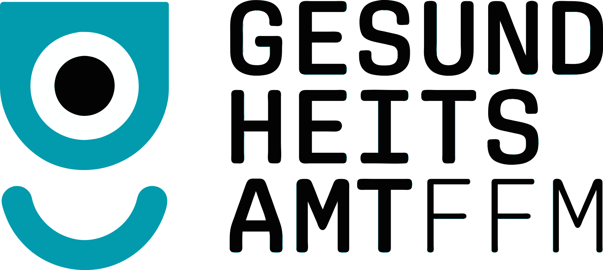

= GA-Lotse
:source-highlighter: rouge

The Einheitliche Software für die hessischen Gesundheitsämter or GA-Lotse (Gesundheitsamt-Lotse) is a software project with the aim to assist the Hessian public health services in their daily business with a modern and unifying software.

== Documentation

Find detailed information in our https://gitlab.opencode.de/ga-lotse/ga-lotse-documentation[documentation].

== Reporting issues
If you find any issues, please report it in this repository.

We appreciate your help in improving the project!

== Module documentation

- link:backend/README.md[Backend]
- link:./employee-portal/README.adoc[Employee Portal]
- link:./citizen-portal/README.adoc[Citizen Portal]
- link:./admin-portal/README.adoc[Admin Portal]

== Further information

- link:https://docs.gradle.org[Getting started with gradle]
- link:docs/dependency-management.adoc[Dependency Management]
- link:docs/e2e-tests.adoc[E2E Tests]
- link:docs/sharing-code.adoc[Sharing Code]
- link:reverse-proxy/README.md[Reverse Proxy]
- link:docs/content-security-policy-header.adoc[Content Security Policy (CSP) Header]
- link:docs/flaky-tests.adoc[Flaky Tests]
- link:docs/migration.adoc[Migration Guide]
- link:docs/authoring-libraries.adoc[Authoring Libraries]

== Licensing

This repository contains code that is licensed under both the **GNU Affero General Public License v3 (AGPL-3.0)** and the **Apache License 2.0**.

=== General Licensing Rules

- **GNU AGPL v3**: This license applies to all files, unless otherwise specified. For the full license text, please refer to the `LICENSE-AGPL-3.0-only.txt` file.

- **Apache License 2.0**: This license applies to all files located in or below a directory that contains a `README_LICENSE.adoc` declaring the use of the Apache License 2.0. For the complete license text, see the `LICENSE-APACHE-2.0.txt` file.

=== Contribution Guidelines

When contributing to this project, please specify the applicable license according to the rules outlined above. This helps us properly incorporate your code into the project.

== Cooperation

Hessisches Ministerium für Familie, Senioren, Sport, Gesundheit und Pflege

