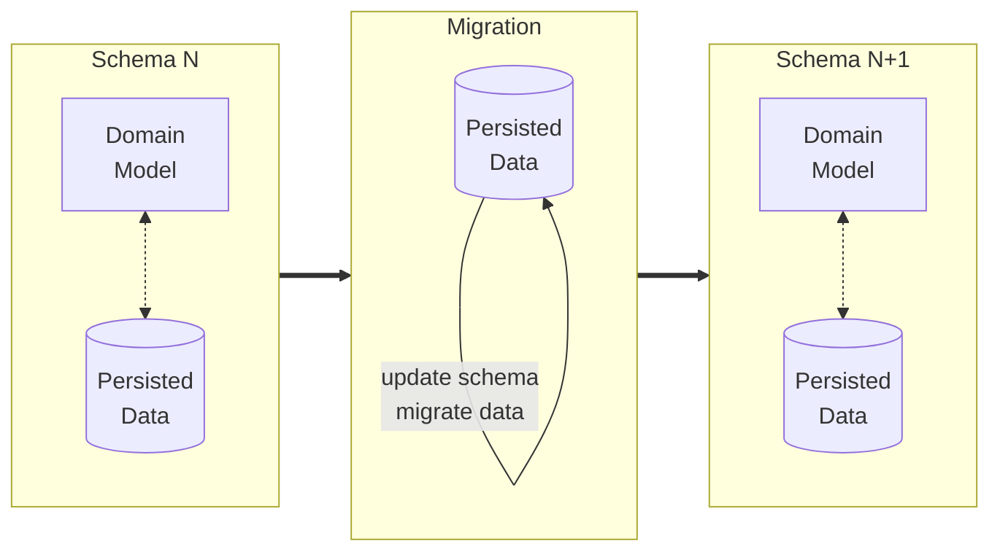

**Note to future editors:** To make it easy for developers to discover
this file, the code contains a link to this file. If you rename or
move this file, please adapt the comment in 
[`MigrationIntegrationTestTraits`](../../../src/testFixtures/java/de/eshg/MigrationIntegrationTestTraits.java)


# Database Migration Tests

## Migrations

We want to be able to improve the database schema continuously, i.e. on
each possible deployment of the system. The change of the database
schema together with the consequent updates to the tables is called a
"migration" (or a "schema migration" or a "database migration"[^1]).

[^1]: For some migrations the database schema does *not* change but the data needs to change.
For example when renaming an enum value where the enum is stored as string.

**Database migrations ensure that the domain model and database schema remain in sync.**



While the application or a test is running, the domain model and the database schema
are in sync.  When the model is changed, the database needs to be migrated.

## Testing Migrations

By default, all integration tests spin-up an empty database and then execute the full list of migrations.
This means that migrations are tested without any pre-existing data.
However, some migrations are complex, and testing them only makes sense if the database contains realistic data.

Consider a migration that includes a carefully crafted SQL `UPDATE` statement. 
It might succeed on an empty database but fail when data is present.
Similarly, introducing a new non-nullable column would pass on an empty database but fail if there’s existing data.

To prevent these oversights, we’ve introduced a mechanism that allows us to write tests for migrations involving data, ensuring a more robust testing process.

# Writing Migration Tests

We start with a database in the *current schema* (the schema before we ran any migrations) and populate it with realistic data, often using our data populators.
After that, we dump the complete state of each module’s database, such as `base-db` and `school-entry-db`, to files.
These files are then added to source control[^2].

Next, we restore these database dumps, run all migrations that did not exist yet when we dumped the state[^3],
and finally validate the database state, typically by reading the data and ensuring that it supports creation and modification as expected.

[^2]: The dump files are located in `src/test/resources/NameOfTheTest/testMethodName`. There’s one file per module. In the example there’s `base.sql` and `school-entry.sql`.
[^3]: Liquibase takes care of this

We write the test in two phases, maintaining at least two separate commits.
This ensures that other developers can see in the source control history exactly how the data and dumps were created.
It also helps us recreate dumps in the future if needed.

**⚠ Ensure that the first phase is based on the software version prior to introducing the schema change and migration!**

In the second phase, we replace all code used for data creation and dumping with the code the restores the database dumps.

### Example: First Commit

```java
class MyMigrationTest extends AbstractSpringBootTest
  implements MigrationIntegrationTestTraits {

  @Test
  void testScenario() throws Exception {
    myDataPopulator.populate(10);
    addSomeMoreSpecialCases();

    // Dump the database state in the old schema, before we ran any migration
    dumpDatabaseSnapshots();

    // read the data as usual via the REST interface
    // and assert it with a validation file
    readAndAssertWithFile();

    // create new data or modify existing data
    createNewData();
  }
}
```

### Example: Second Commit

```java
class MyMigrationTest extends AbstractSpringBootTest
  implements MigrationIntegrationTestTraits {
  
  @Test
  void testScenario() throws Exception {
    restoreDatabaseSnapshots();

    // read the data as usual via the REST interface
    // and assert it with a validation file
    readAndAssertWithFile();

    // create new data or modify existing data
    createNewData();
  }
}
```

The migration test mechanism ensures that all new Liquibase migrations are executed in `restoreDatabaseSnapshots`.
Once a migration test is prepared, you can proceed with implementing the schema change and the corresponding Liquibase migration as usual.
The tests you just created will verify that your migration performs as expected.

Please have a look at [`SchoolEntryMigrationIntegrationTest`](../../../../school-entry/src/test/java/de/eshg/schoolentry/SchoolEntryMigrationIntegrationTest.java)) for a real-world example how migration tests could be written.
This implementation also serves as an example how to implement `dumpDatabaseSnapshots()` and `restoreDatabaseSnapshots()`.

## Getting Started with Writing a Migration Test

1. **Write the Test(s):** Begin by writing the necessary tests to ensure the model change behaves as expected.
   Focus on identifying what aspects need to be validated.

2. **Implement the Model Change:** Once the tests are in place, implement the model change to meet your requirements.

3. **Apply Liquibase Migrations:** Update the database schema and add any required Liquibase migrations to align with the model change.

4. **Verify Test Success:** Run the tests to confirm they pass. Review any potential changes in validation files and ensure they align with the model change.

**Note:** If you prefer, you can implement the model change first and then write the tests. In that case, you may rebase the commits accordingly after following the steps above.
