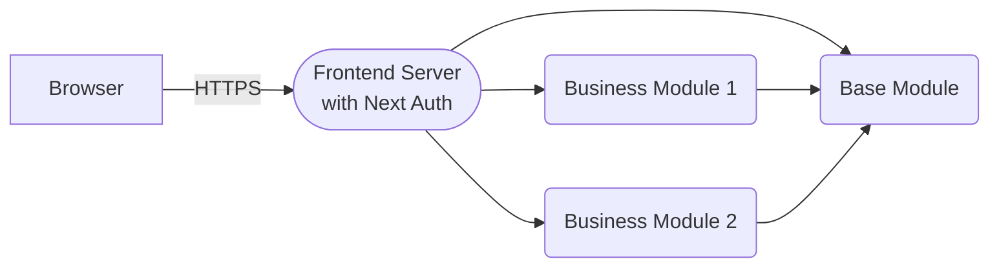
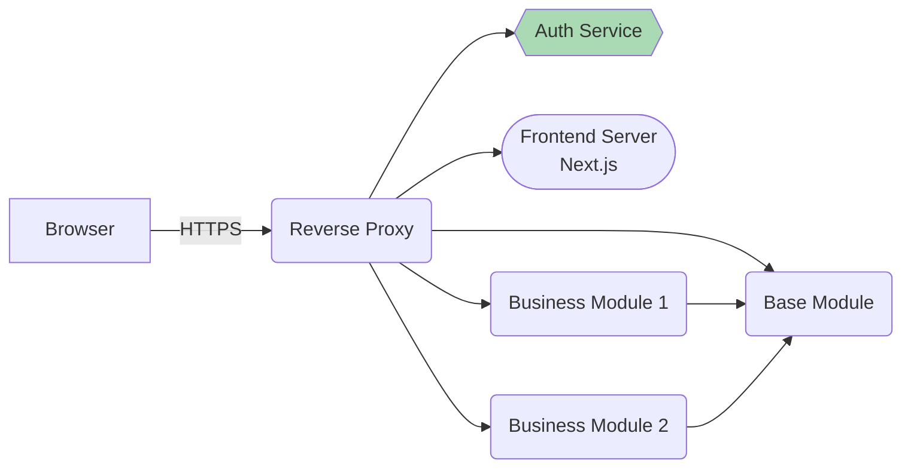
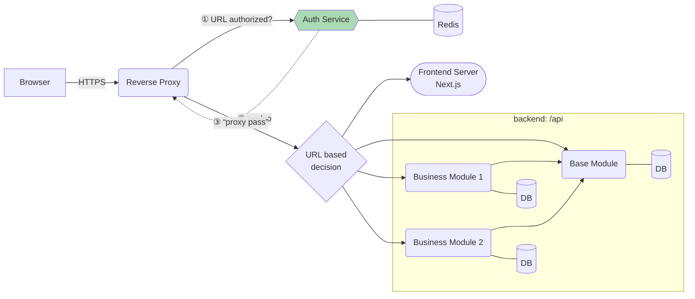
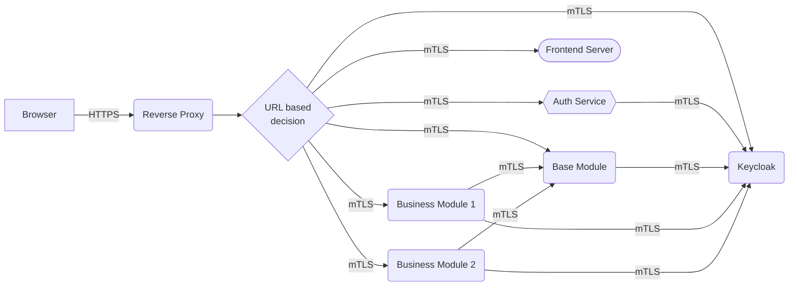
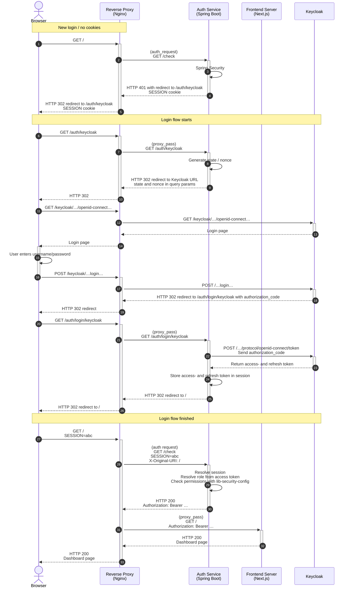
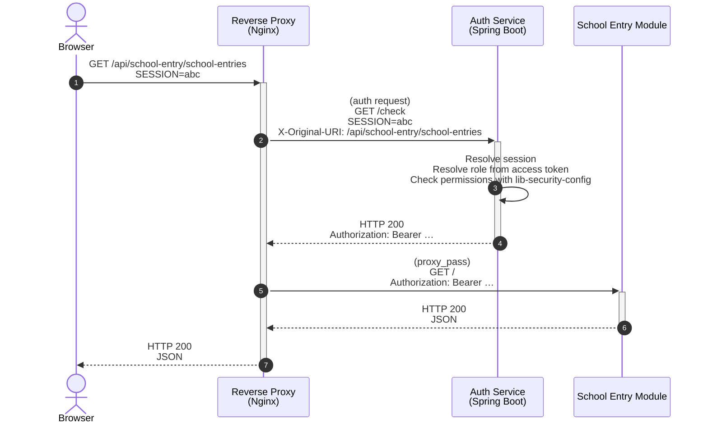
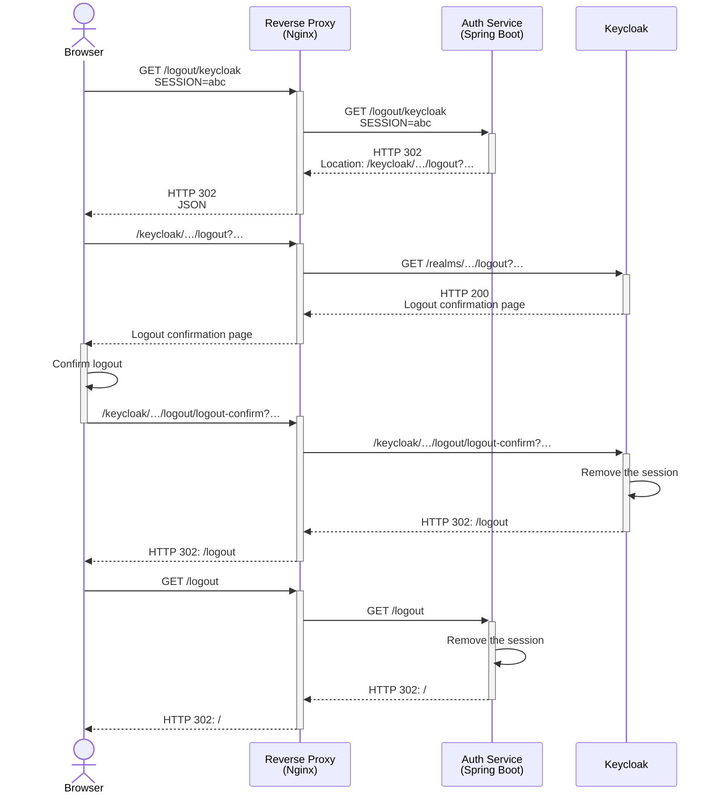

## Components

### Current architecture

### New architecture

### New version (more details)

### New version (communication)

## Login Sequence Diagram

## Backend Access Sequence Diagram

## Logout

